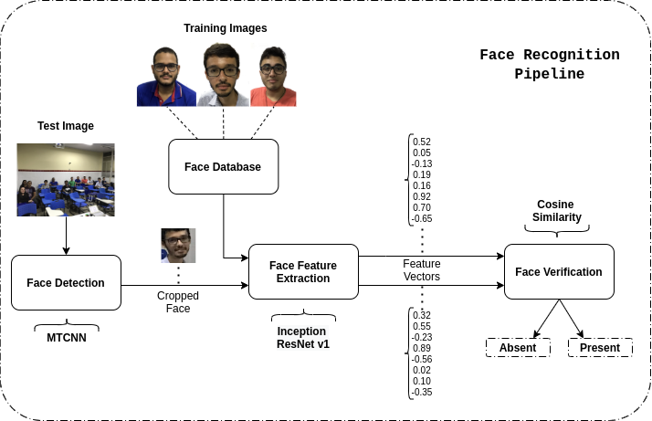

[](https://www.python.org/)
[](https://codecov.io/gh/angelomenezes/face-attendance-api)

<h1 align="center"> Face Attendance API </h1>

> API para automatizar o processo de chamada em uma sala de aula através do uso de reconhecimento facial

## Motivo
O processo de conferência da presença dos alunos toma muitas vezes grande parte da aula a depender do tamanho da turma. Com isso em mente, o professor Dr. Carlos Estombelo da Universidade Federal de Sergipe propôs a utilização de um aplicativo que fizesse a conferência da chamada de maneira automática através da utilização de reconhecimento facial em uma foto da turma no dia da aula. 

Esse repositório contém o backend desenvolvido por [Angelo Menezes](https://angelomenezes.github.io) que possibilita o cadastro de professores, turmas, alunos e o registro da presença dos mesmos em cada aula através do uso de um algoritmo de reconhecimento facial (Ver [Reconhecimento Facial](#reconhecimento-facial)). Esse repositório é um "clone" do repositório original, não contendo algumas informações específicas que se referem a adaptação com o sistema próprio da universidade, utilizado para gestão acadêmica. 

## API Endpoints
Para desenvolvimento do backend, foram utilizados SQLAlchemy, como ORM para o preparo do banco de dados (SQLite), e Flask e Flask-RestX, para estabelecimento dos acessos aos endpoints necessários para a aplicação em questão. A pipeline de testes unitários e integração dos endpoints foi feita utilizando Pytest.

<div style="text-align:center"></div>

### Documentação
A documentação de todos os Endpoints foi gerada automaticamente através do próprio framework do Flask-RestX e utiliza o OpenAPI 2.0 (Swagger).

### Autenticação
O sistema de autenticação utilizado foi o JWT (JSON Web Token). Com isso, uma vez feito o login, todas as requisições precisam enviar a token referente ao usuário.

## Reconhecimento Facial

Para efetuar o processo de reconhecimento facial, foi utilizado a estratégia de "One-Shot Learning" uma vez que somente uma imagem por aluno está disponível para treinamento. Para cadastro de um aluno na plataforma, é enviado uma imagem do rosto do mesmo que terá o seu vetor de características extraído utilizando uma rede convolucional Inception Resnet pré-treinada no dataset [VGG-Face2](https://ieeexplore.ieee.org/document/8373813) e salvo no banco de dados. Uma vez que o professor tira a foto da turma no dia da aula, as faces são detectadas utilizando também uma rede convolucional ([MTCNN](https://ieeexplore.ieee.org/document/7553523)), o vetor de característica de cada face encontrada é extraído utilizando de novo a rede Inception, e então comparado com o das faces já presentes no banco de dados para aquela turma. Dessa forma, através da avaliação da similaridade cosseno entre os vetores de características, é registrado a presença ou ausência dos estudantes naquela aula. Tanto a detecção quanto a extração de características foram feitas utilizando a biblioteca disponibilizada pelo repositório [FaceNet Pytorch](https://github.com/timesler/facenet-pytorch).



Caso o professor venha mudar manualmente a presença de um aluno, após a etapa do reconhecimento facial com uma requisição de atualização (PUT) para o servidor, uma anotação de erro é registrada automaticamente, em uma tabela no banco de dados, indicando se o algoritmo entregou um falso positivo ou negativo de acordo com o teor da mudança. 

Para saber mais detalhes sobre a estratégia de reconhecimento facial utilizada nesse repositório: 

[Automatic Attendance Management System based on Deep One-Shot Learning](https://ieeexplore.ieee.org/abstract/document/9145230)

Caso queira citá-la:

```bibtex
@inproceedings{menezes2020automatic,
  title={Automatic Attendance Management System based on Deep One-Shot Learning},
  author={Menezes, Angelo G and S{\'a}, Jo{\~a}o MD da C and Llapa, Eduardo and Estombelo-Montesco, Carlos A},
  booktitle={2020 International Conference on Systems, Signals and Image Processing (IWSSIP)},
  pages={137--142},
  year={2020},
  organization={IEEE}
}
```

## Setup

Para configurar a API, é aconselhável o uso de um ambiente virtual (virtualenv, conda, ...) para instalação das dependências.

### Para instalação e configurações básicas 
```sh
# Instalação de pacotes
make install

# Inicialização do banco de dados
make init_db

# Criar arquivo contendo chave secreta para criação dos tokens
echo JWT_SECRET_KEY="'YOUR_SECRET_KEY_GOES_HERE'" > ./core/.env
```

### Para realização dos testes com a biblioteca *Pytest* e seus plugins
```sh
make test
```

### Para inicializar servidor Flask e API
```sh
make run
```

Para utilização geral da API com o Swagger, fazer login com usuário 'admin' e senha '12345' para obter token necessária para autenticação.

## Referências

[1] Q. Cao, L. Shen, W. Xie, O. M. Parkhi, A. Zisserman. VGGFace2: A dataset for recognising face across pose and age, International Conference on Automatic Face and Gesture Recognition, 2018.

[2] K. Zhang, Z. Zhang, Z. Li and Y. Qiao. Joint Face Detection and Alignment Using Multitask Cascaded Convolutional Networks, IEEE Signal Processing Letters, 2016.

[3] Facenet Pytorch repository (https://github.com/timesler/facenet-pytorch)

